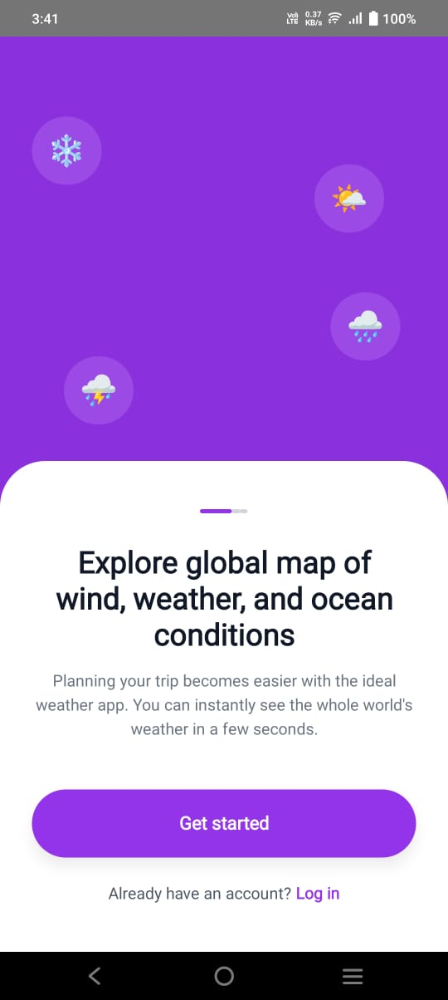
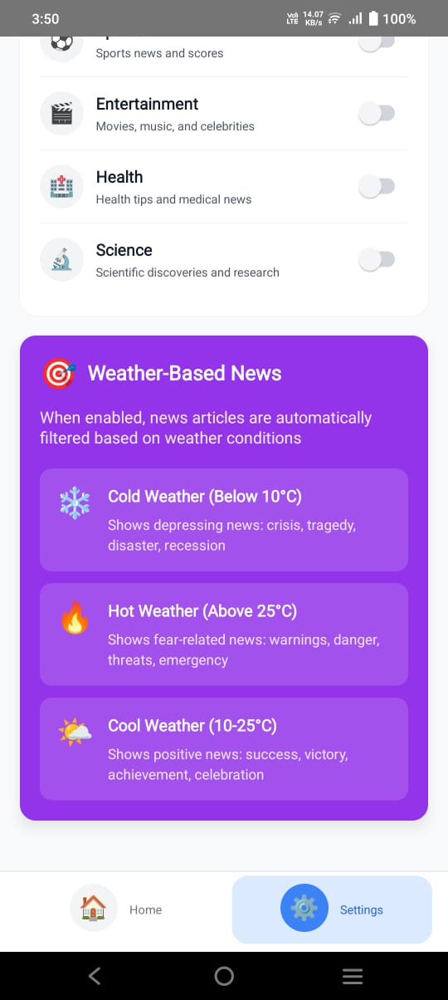

# 🌦️ Weather & News App — Task Project (i2Global)

This repository contains the **Weather and News mobile application** developed as a **task project for i2Global Company**.  
It is built using the latest **React Native 0.82.1** with **NativeWind (TailwindCSS)** integration for modern, responsive UI development.

---

## 📱 Project Overview

The goal of this project is to create a **React Native** mobile application with a clean setup, proper configuration, and a scalable structure that supports:
- Weather and News data presentation (planned features)
- TailwindCSS-based styling using NativeWind
- Smooth developer experience with hot reload and clean architecture

---

## 📸 App Screenshots

<div align="center">

### Splash Screen


---

### Home Screens

<table>
  <tr>
    <td align="center">
      <br/>
      <b>Home (Celsius)</b>
    </td>
    <td align="center">
      <br/>
      <b>Home (Fahrenheit)</b>
    </td>
  </tr>
</table>

---

### News Screens

<table>
  <tr>
    <td align="center">
      <br/>
      <b>News</b>
    </td>
    <td align="center">
      <br/>
      <b>News Modal</b>
    </td>
  </tr>
</table>

---

### Settings Screens

<table>
  <tr>
    <td align="center">
      <br/>
      <b>Settings 1</b>
    </td>
    <td align="center">
      <br/>
      <b>Settings 2</b>
    </td>
  </tr>
</table>

</div>

---

## ⚙️ Tech Stack

| Technology | Version | Description |
|-------------|----------|-------------|
| React Native | 0.82.1 | Latest stable release (Fabric architecture enabled) |
| React | 19.1.1 | Core React library |
| NativeWind | 4.2.1 | TailwindCSS for React Native |
| TailwindCSS | 3.4.18 | Utility-first CSS styling |
| TypeScript | 5.8.3 | Strongly typed JavaScript |
| ESLint + Prettier | — | Code linting and formatting |
| React Native Reanimated | 4.1.3 | Animation support |

---

## 🛠️ Installation & Setup

### 1️⃣ Clone the Repository
```bash